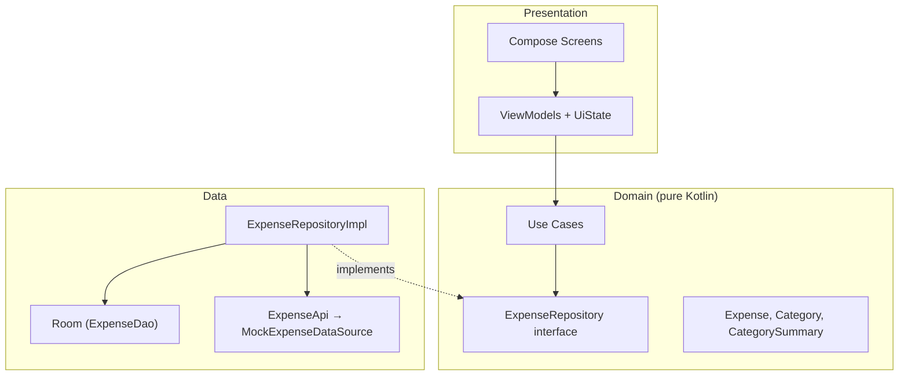
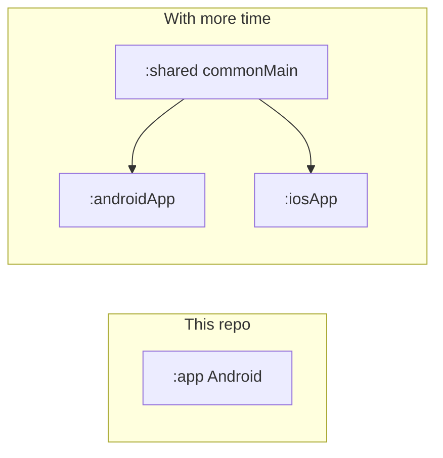

# Expense Tracker — Android (Clean Architecture)

Expense tracking with **Jetpack Compose**, **MVVM**, **Clean Architecture**, **offline-first Room**, category/date **filtering**, **spending summary**, and **domain unit tests**.

| Document | Location |
|----------|----------|
| **This README** | Repository root (start here for assessors) |
| **Android project** | [`expenseTracker/`](expenseTracker/) — open in Android Studio |
| **ADRs** | [`ADR.md`](ADR.md) |
| **AI transcript** | [`docs/ai-transcript.md`](docs/ai-transcript.md) |
| **CI** | [`.github/workflows/ci.yml`](.github/workflows/ci.yml) |

### Road Map

| Feature | Section |
|-------------|---------|
| Architecture overview (+ diagram) | [Architecture overview](#architecture-overview) |
| How to build and run | [How to build and run](#how-to-build-and-run) |
| Assumptions | [Assumptions](#assumptions) |
| What you would do differently with more time | [What you would do differently with more time](#what-you-would-do-differently-with-more-time) |
| ADR | [ADR.md](ADR.md) |
| Tests + how to run | [Testing strategy](#testing-strategy) · `./gradlew test` |
| AI usage disclosure | [AI usage disclosure](#ai-usage-disclosure) |

---

## Features

- View, add, and delete expenses (sorted by date on the list)
- **Delete confirmation** — `AlertDialog` before removing an expense
- Filter by **category** and **date range**
- **Category summary** (totals, counts, percentages)
- Loading, empty, and error states with retry
- **Offline-first**: Room is the single source of truth; mock API syncs in the background

### Implementation phases

| Tier | Item | Status |
|------|------|--------|
| **Tier 1** | Expense list, add/delete, layered architecture, ≥3 unit tests, README 
| **Tier 2** | Filtering, error handling, loading/empty UI, ADR, DI, repository abstraction 
| **Tier 3** | Offline-first (Room), summary view, CI (GitHub Actions)

---

## Architecture overview

The app uses **MVVM** on top of **Clean Architecture**: UI never talks to Room or the API directly; it goes through ViewModels → use cases → repository.

### Layer diagram



### Data flow (offline-first)

1. **Reads:** UI observes `Flow` from Room via repository (reactive list and summary).
2. **Writes:** Insert/delete in Room first; mock API called in a try/catch (fire-and-forget sync).
3. **Refresh:** `RefreshExpensesUseCase` pulls mock remote data and replaces Room contents.

### Package layout (`expenseTracker/app/src/main/java/com/example/expensetracker/`)

| Layer | Packages |
|-------|----------|
| Presentation | `presentation/*`, `navigation/`, `ui/theme/` |
| Domain | `domain/model/`, `domain/usecase/`, `domain/repository/`, `domain/util/` |
| Data | `data/local/`, `data/remote/`, `data/repository/`, `data/mapper/` |
| DI | `di/` (Hilt modules) |

### Network contract (mock, swappable)

Designed as if these were real REST endpoints; swap `MockExpenseDataSource` for Retrofit with minimal changes (`ExpenseApi` + DTOs already mirror the contract).

| Method | Endpoint | Purpose |
|--------|----------|---------|
| GET | `/api/expenses` | List expenses |
| GET | `/api/expenses?category={cat}&from={date}&to={date}` | Filter |
| POST | `/api/expenses` | Create |
| DELETE | `/api/expenses/{id}` | Delete |
| GET | `/api/expenses/summary` | Category summary (summary also computed locally from Room for offline consistency) |

**Models:** `Expense` (id, amount, currency, category, note, date, createdAt); `CategorySummary` (category, total, count, percentage). Categories: `food`, `transport`, `entertainment`, `shopping`, `bills`, `other`.

### Tech stack

Kotlin · Jetpack Compose · Material 3 · Navigation Compose · Hilt · Coroutines · Flow · Room · JUnit · MockK

---

## How to build and run

### Prerequisites

- **Android Studio** Ladybug (2024.2+) or newer recommended
- **JDK 17** — Gradle JDK and `jvmToolchain(17)` / `compileOptions` (CI uses 17)
- **Android SDK** with API 36 (compile) and a device/emulator ≥ API 24 (minSdk)

### Open the project

1. Clone this repository.
2. In Android Studio: **File → Open** → select the [`expenseTracker/`](expenseTracker/) folder (Gradle root).
3. Wait for Gradle sync to finish.

### Run on device or emulator

- Select a run configuration for the `app` module and click **Run**, or from `expenseTracker/`:

```bash
chmod +x gradlew   # once, if needed
./gradlew installDebug
```

### Command-line build

From `expenseTracker/`:

```bash
./gradlew assembleDebug
```

---

## Testing strategy

**Focus:** domain use cases and validation rules (pure Kotlin, fast, no Android framework). **20 tests** across the five use-case test classes below.

| Test class | What it verifies |
|------------|------------------|
| `AddExpenseUseCaseTest` | Valid expense persisted; invalid amount rejected |
| `DeleteExpenseUseCaseTest` | Delete delegates to repository |
| `FilterExpensesUseCaseTest` | Category and date-range filtering |
| `GetSummaryUseCaseTest` | Summary flow from repository |
| `RefreshExpensesUseCaseTest` | Refresh triggers repository sync |

Run all unit tests from `expenseTracker/`:

```bash
./gradlew test
```

Reports: `app/build/reports/tests/testDebugUnitTest/index.html`

**Not covered (by choice, time-boxed):** Compose UI tests, instrumented tests, repository integration tests against in-memory Room.

---

## Assumptions

- **Single user, single device** — no auth, accounts, or multi-device sync.
- **Currency** — amounts stored with a `currency` field; UI uses a fixed display format (no FX conversion).
- **Conflict resolution** — last-write-wins on refresh; no merge strategy for concurrent edits.
- **Filtering** — applied in the domain layer on lists from Room via `FilterExpensesUseCase`. When **both** category and date range are set, an expense matches if it satisfies **either** filter; if only one dimension is set, that filter alone applies. Mock API supports query params for a future real client.
- **Summary** — computed from local expenses in `CategorySummaryCalculator` so the summary screen works offline; mock `GET /api/expenses/summary` exists for API parity.
- **Date inputs** — `java.time.LocalDate` / ISO-8601 strings aligned with the assessment contract.
- **Assessment time** — ~2–4 hours suggested; Tier 3 items deprioritized in favor of structure, ADRs, and tests (see [Important Notes](#important-notes) from the brief).

---

## What you would do differently with more time

1. **Kotlin Multiplatform** — extract `domain/` to `commonMain`, SQLDelight + Ktor `actual`s for Android/iOS (see [ADR-004](ADR.md#adr-004-android-only-for-assessment-kotlin-multiplatform-deferred)).
2. **Production sync** — WorkManager queue, retry/backoff, optimistic UI with rollback, server timestamps for conflicts.
3. **Real HTTP client** — Retrofit + OkHttp implementing `ExpenseApi`, with interceptors and structured error mapping to user-facing states.
4. **Edit expense** — update use case, DAO `UPDATE`, and navigation from list item.
5. **Input validation UX** — inline field errors, accessibility labels, content descriptions for screen readers.
6. **Multi-currency** — locale-aware formatting (`NumberFormat`), optional default currency in settings.
7. **Tests** — repository tests with in-memory Room; Compose UI tests for empty/error flows.
8. **Pagination** — `PagingSource` on `ExpenseDao` for large lists.



---

## Tier 3 — Stretch (not implemented)

| Stretch goal | Notes |
|--------------|-------|
| Accessibility (TalkBack, dynamic type) | Basic Compose defaults only |
| Multi-currency / advanced formatting | Fixed formatting |
| Performance doc (list recycling) | LazyColumn used; no separate perf write-up |
| Full offline sync polish | Room SSOT yes; production-grade sync no |

---

## CI

GitHub Actions on `main`: unit tests + debug APK build. See [`.github/workflows/ci.yml`](.github/workflows/ci.yml). All commands run with `working-directory: expenseTracker`.

---

## AI usage disclosure

AI tools were used **materially** during this submission, in line with the assessment brief.

| Tool | How it was used |
|------|-----------------|
| **Cursor (Claude)** | Scaffolding Clean Architecture packages, Compose screens, Room/Hilt wiring, mock API layer, unit test templates, `ADR.md` drafts, and this README structure |
| **Human direction** | Architecture choices (MVVM + Clean, Room SSOT, Hilt), feature prioritization, review/editing of generated code, commit granularity, and final wording of ADRs |

**Transcript evidence:** [docs/ai-transcript.md](docs/ai-transcript.md) — session summary, paraphrased prompts, human vs AI decisions, and optional link to a Cursor chat export. Review for secrets before sharing externally.


---

## Important notes (from the brief)

- **Completeness vs. quality** — structure, ADRs, and documentation are intentional;
- **Ambiguity** — decisions are documented in [Assumptions](#assumptions) and [ADR.md](ADR.md).

---

## License

See [LICENSE](LICENSE).
