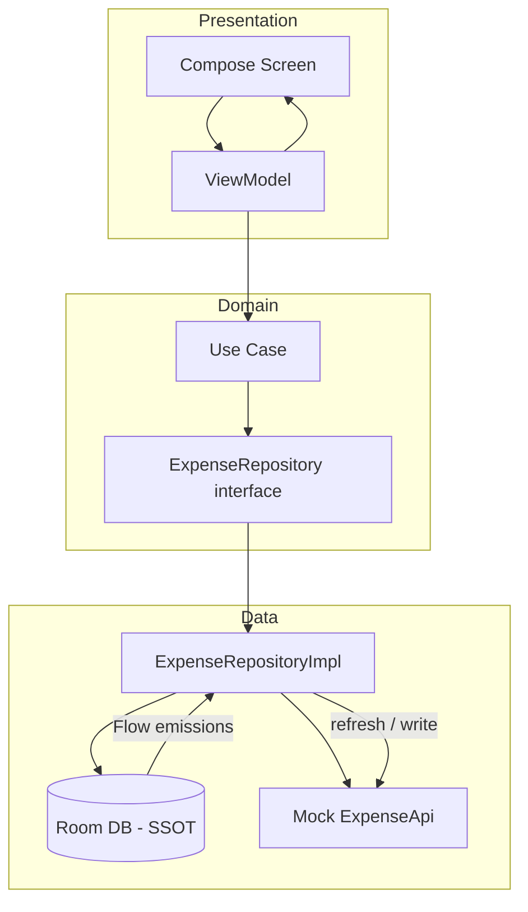

# Expense Tracker — Android (Clean Architecture)

A tech-lead assessment submission: expense tracking with **Jetpack Compose**, **MVVM**, **Clean Architecture**, **offline-first Room**, category/date **filtering**, **spending summary**, and **domain unit tests**.

| Document | Location |
|----------|----------|
| **This README** | Repository root (start here for assessors) |
| **Android project** | [`expenseTracker/`](expenseTracker/) — open in Android Studio |
| **ADRs** | [`ADR.md`](ADR.md) |
| **CI** | [`.github/workflows/ci.yml`](.github/workflows/ci.yml) |

---

## Features

- View, add, and delete expenses
- Filter by **category** and **date range**
- **Category summary** (totals, counts, percentages)
- Loading, empty, and error states with retry
- **Offline-first**: Room is the single source of truth; mock API syncs in the background

---

## Architecture overview

The app uses **MVVM** on top of **Clean Architecture**: UI never talks to Room or the API directly; it goes through ViewModels → use cases → repository.

### Layer diagram

```
┌──────────────────────────────────────────────────────────────────┐
│                     PRESENTATION (Android)                        │
│   Compose Screens  ←→  ViewModels (Hilt)  ←→  sealed UiState     │
│   Navigation Compose · stringResource() · Material 3               │
└───────────────────────────────┬──────────────────────────────────┘
                                │ calls use cases only
                                ▼
┌──────────────────────────────────────────────────────────────────┐
│                     DOMAIN (pure Kotlin)                            │
│   Expense · Category · Use Cases · ExpenseRepository (interface) │
│   FilterExpenses · GetSummary · Add/Delete · RefreshExpenses     │
└───────────────────────────────┬──────────────────────────────────┘
                                │ implemented by
                                ▼
┌──────────────────────────────────────────────────────────────────┐
│                     DATA (Android)                                │
│   ExpenseRepositoryImpl · Room (SSOT) · MockExpenseDataSource    │
│   ExpenseApi contract · Entity/DTO mappers · CategoryMapper      │
└──────────────────────────────────────────────────────────────────┘
```

### Request / data flow (typical screen)



### Layer responsibilities

| Layer | Packages (under `app/.../expensetracker/`) | Responsibility |
|-------|--------------------------------------------|----------------|
| **Presentation** | `presentation/`, `navigation/`, `ui/theme/` | UI, navigation, `StateFlow` / `UiState`, user events |
| **Domain** | `domain/model/`, `domain/repository/`, `domain/usecase/` | Business rules, validation, filtering, summary math |
| **Data** | `data/local/`, `data/remote/`, `data/repository/`, `data/mapper/` | Persistence, API, mapping, repository implementation |
| **DI** | `di/` | Hilt modules wiring implementations to interfaces |

### Key decisions (short)

- **Room = SSOT** — UI reads via `Flow`; writes go to Room first, then sync to API
- **`ExpenseApi`** — mirrors REST (category, `from`, `to`, summary) for a future Retrofit/Ktor client
- **Use cases** — ViewModels do not call `ExpenseRepository` directly for refresh (see `RefreshExpensesUseCase`)
- **Domain is Android-free** — ready to move into a KMP `:shared` module later ([ADR-004](ADR.md))

Full rationale: **[ADR.md](ADR.md)** (ADR-001 … ADR-004).

---

## Tech stack

| Area | Choice |
|------|--------|
| Language | Kotlin |
| UI | Jetpack Compose, Material 3, Navigation Compose |
| Architecture | MVVM + Clean Architecture + Repository |
| DI | Hilt |
| Async | Coroutines, Flow, `collectAsStateWithLifecycle` |
| Local DB | Room (offline-first) |
| Remote | Mock datasource behind `ExpenseApi` |
| Tests | JUnit 5, MockK, `kotlinx-coroutines-test` (domain only) |

---

## Project structure

```
expense-tracker-compose-clean-architecture/
├── README.md                 ← you are here
├── ADR.md
├── .github/workflows/ci.yml
└── expenseTracker/           ← Gradle root (open in Android Studio)
    └── app/src/main/java/com/example/expensetracker/
        ├── presentation/     # Screens, ViewModels, components
        ├── domain/           # Models, repository contract, use cases
        ├── data/             # Room, API, repository impl, mappers
        ├── di/               # Hilt
        └── navigation/       # NavGraph
```

---

## How to build and run

### Prerequisites

- **Android Studio** Hedgehog (2023.1.1) or newer
- **JDK 17**
- **Android SDK 36** (`compileSdk`; `targetSdk` 34)
- **minSdk** 24

### Steps

1. **Clone**
   ```bash
   git clone <repository-url>
   cd expense-tracker-compose-clean-architecture
   ```

2. **Open in Android Studio**
   - **File → Open**
   - Select the **`expenseTracker`** folder (not the repo root)
   - Wait for Gradle sync

3. **Build**
   ```bash
   cd expenseTracker
   ./gradlew assembleDebug
   ```

4. **Run on device/emulator**
   ```bash
   ./gradlew installDebug
   ```
   Or use the **Run** button in Android Studio.

5. **Unit tests** (domain layer)
   ```bash
   cd expenseTracker
   ./gradlew test
   ```

6. **Full CI locally** (same as GitHub Actions)
   ```bash
   cd expenseTracker
   ./gradlew test assembleDebug
   ```

### CI (GitHub Actions)

On push/PR to `main`, from [`.github/workflows/ci.yml`](.github/workflows/ci.yml):

- `working-directory: expenseTracker`
- `./gradlew test`
- `./gradlew assembleDebug`

---

## Assumptions

### Product and scope

| Topic | Assumption | Notes |
|-------|------------|--------|
| **Time box** | ~2–4 hours for implementation + docs | Android-only delivery prioritized over KMP scaffolding |
| **Platforms** | Android required by brief; iOS not in scope | Domain written without Android APIs for future KMP |
| **Users** | Single user, single device | No auth, no multi-device sync rules |
| **Currency** | LKR in UI; `currency` on model | Multi-currency UI out of scope |
| **Filters** | If **both** category and dates set → **OR**; else filter by the one dimension set | Implemented in `FilterExpensesUseCase`; would confirm with PM in production |

### Technical

| Topic | Assumption | Notes |
|-------|------------|--------|
| **Backend** | No real server | `MockExpenseDataSource` + ~1s delay; `ExpenseApi` ready for Retrofit/Ktor |
| **Conflicts** | Last-write-wins on sync | Fine for single-user; not for collaborative editing |
| **Persistence** | Room on Android | KMP would use SQLDelight or Room KMP in platform `actual` |
| **DI** | Hilt on Android only | Shared KMP code would use constructor injection + Koin or manual graph |
| **Pagination** | Not implemented | `LazyColumn` uses stable `key = { it.id }` |
| **Delete** | No confirmation dialog | Listed under future work |
| **Errors** | User taps retry on error state | No WorkManager backoff queue in scope |
| **Strings** | `res/values/strings.xml` | No hardcoded UI copy |
| **KMP** | **Not in this repository** | Would need `:shared`, expect/actual, multi-platform CI — see below |

---

## Testing strategy

**20 domain unit tests** under `expenseTracker/app/src/test/.../domain/usecase/`:

| Use case | Focus |
|----------|--------|
| `AddExpenseUseCase` | Validation (e.g. amount > 0) |
| `DeleteExpenseUseCase` | Repository interaction |
| `FilterExpensesUseCase` | Category, dates, OR logic |
| `GetSummaryUseCase` | Percentages, sorting, edge cases |
| `RefreshExpensesUseCase` | Sync invokes repository |

**Not covered (time-boxed):** ViewModels, Room integration tests, Compose UI tests.

---

## What I would do in the future (more time)

### 1. Kotlin Multiplatform (primary architectural upgrade)

With a **multi-platform product** mandate and more than a few days, I would **not** maintain duplicate Android/iOS business logic. I would extract today’s `domain/` (and repository interfaces) into KMP:

```
:shared (commonMain)
  domain models · use cases · repository interfaces · commonTest

:shared (androidMain / iosMain)
  actual: DB driver · HTTP · platform date/locale

:androidApp
  Compose UI · Hilt · Room or SQLDelight driver

:iosApp (optional)
  SwiftUI or Compose Multiplatform
```

| Share in `commonMain` | Keep platform-specific |
|------------------------|-------------------------|
| Models, use cases, filter/summary rules | Room / SQLDelight |
| Repository contracts | Ktor or Retrofit client |
| `commonTest` for all use case tests | Hilt (Android), UI toolkit |

**UI options:** Compose Multiplatform (one UI codebase) **or** shared ViewModels/MVI in `commonMain` with native SwiftUI on iOS.

**Why not KMP in this submission:** Gradle modules, expect/actual, and iOS CI need **days**, not hours. This repo optimizes for a **complete Android app**, ADRs, and domain tests. See **[ADR-004](ADR.md)**.

### 2. Backend and sync

- Real REST API + OpenAPI spec in repo
- **Ktor** shared client (KMP) or Retrofit (Android)
- **WorkManager** retry queue; server timestamps; explicit conflict policy

### 3. Product and quality

- Edit expense, delete confirmation, search, pagination
- Multi-currency formatting
- Charts / analytics
- ViewModel + Compose UI tests; `commonTest` on JVM for shared logic
- CI matrix: JVM `shared` + Android + optional iOS simulator

### Near-term (Android-only, no KMP)

- Retrofit/Ktor replacing mock API
- Paging, search, edit flow
- Deeper test coverage (ViewModel, UI)
- Export (CSV), improved network error UX

---

## Known limitations

1. No delete confirmation
2. No edit expense
3. No search / pagination
4. Single currency (LKR) in UI
5. Basic refresh error handling
6. No export or authentication
7. Tests limited to domain layer
8. **Kotlin Multiplatform not implemented** (documented migration path above)

---

## AI usage disclosure

- **Cursor** — implementation, refactoring, documentation
- **Claude** — early scaffolding for models, UI, ADRs

All generated code was reviewed. I can explain design and implementation choices.

**AI transcript:** add your Cursor export link here before submission.

---

## Performance notes

- `LazyColumn` with `key = { it.id }`
- Summary via `GetSummaryUseCase` / `CategorySummaryCalculator` (not in Composables)
- Room `Flow` + lifecycle-aware collection
- Strings externalized for localization

---

## License

Technical assessment submission. All rights reserved.
